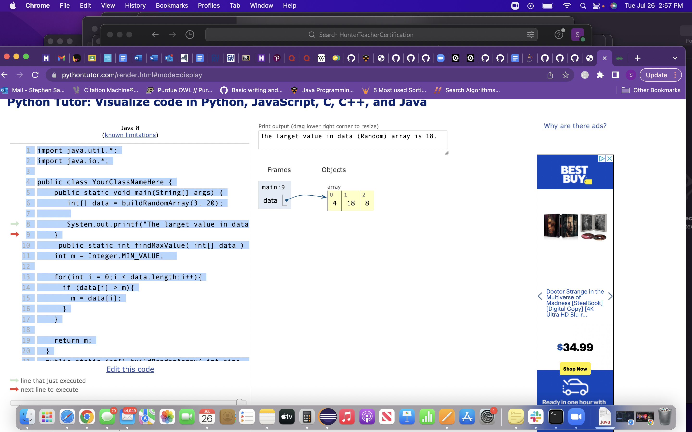
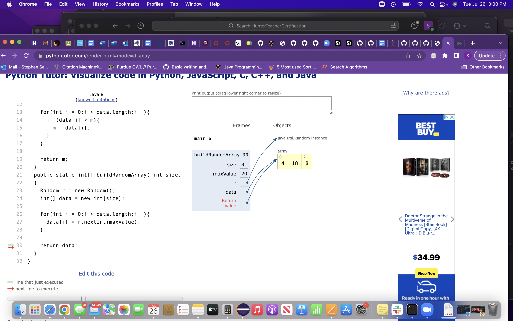

# Team: Room 13
## Steve Sabaugh, Latoya Boland, Yenmin Young

### Goal: Use Python Tutor to visualize arrays and for loops

### Problem: 
Write a function that searches through an array and returns the largest value.

### Sample Code:

import java.util.*;
import java.io.*;

public class YourClassNameHere {
	    public static void main(String[] args) {
       int[] data = buildRandomArray(3, 20);
	      
	       System.out.printf("The larget value in data (Random) array is %s.\n", findMaxValue(data));
     }
	    public static int findMaxValue( int[] data ) {
	    int m = Integer.MIN_VALUE;
	
	    for(int i = 0;i < data.length;i++){
	      if (data[i] > m){
	        m = data[i];
	      }
	    }
	
	    return m;
	  }
	  public static int[] buildRandomArray( int size, int maxValue )
	  {
	    Random r = new Random();
	    int[] data = new int[size];
	
	    for(int i = 0;i < data.length;i++){
	      data[i] = r.nextInt(maxValue);
	    }
	
	    return data;
	  }
	} 

### Python Tutor:
Use Python Tutor to trace the code line by line to better understand the code as well as identify any errors.

### Questions:

- How does the loop work?
- Where there any errors? Explain.
- Are you able to fix the errors? Explain.

